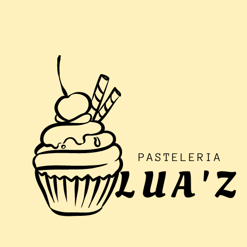

#Módulo HTML
En el trayecto de convertirse en un Developer Full Stack realizamos prácticas que nos ayudaran a mejorar nuestros aprendizajes, en este modulo creados un sitio para una pasteleria.
## LUA'Z
Es la creacion de una pasteleria tradicional, conde se muestra información de contacto, los pedidos que puedes realizar segun un formulario, las especialidades que manejan, y precios, con el fin de ahorrar tiempo para ambas partes.

# [PATELERIA LUA'Z](./index.html)
